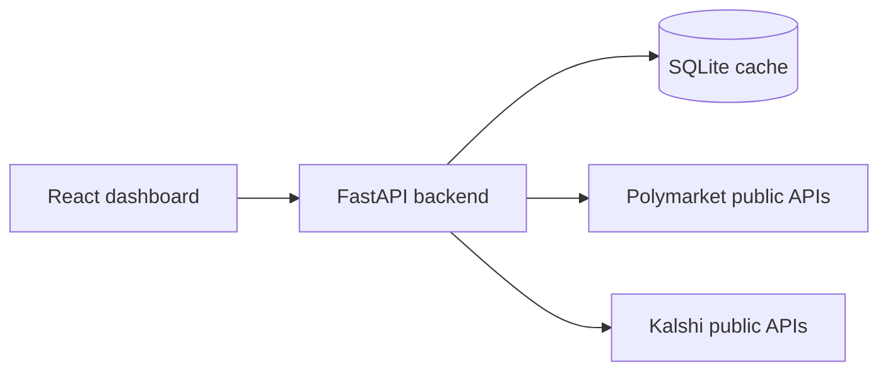

# Market Dashboard

Read-only hiring-test dashboard that compares historical market volume on Polymarket and Kalshi using only public market-data APIs. The frontend talks only to the local backend, and the backend normalizes upstream payloads into UTC daily aggregates stored in SQLite.

## What the app shows

- One shared chart for Polymarket and Kalshi
- Range switches: `7d`, `30d`, `90d`, `all time`
- Category filters across both platforms
- Totals cards for both platforms and their difference
- Loading, empty, stale, partial, and error states
- Manual refresh and CSV export

## Metric used in this submission

This project now uses one stable metric and does not keep changing it:

- The dashboard shows **market volume in USD notional**.
- It is **not** trying to reconstruct exact premium/cash paid on every fill.
- Internally some fields are still named `turnover_usd`, but for demo purposes they should be read as **USD-notional market volume**.

Current source paths:

- `Polymarket`:
  - Platform-wide daily chart series comes from public `GET /v1/builders/volume?timePeriod=DAY`, aggregated by UTC day across returned builders.
  - Category-filtered Polymarket chart series is estimated by scaling that public platform-wide daily series by the selected categories' metadata share for the chosen range.
  - Category-filtered Polymarket daily history remains limited to materialized public trades because the public trade endpoint does not expose a clean full historical category backfill.
- `Kalshi`:
  - Recent daily series comes from public candlestick `volume_fp`, aggregated by UTC day across the materialized market registry.
  - This is the most stable public-data path for the demo build.

## Honesty about data coverage

This submission is designed to be **finished and explainable**, not to be a perfect historical ingestion system.

- `Polymarket` public trade history is partial. The public `/trades` endpoint does not expose a clean full exchange-wide category backfill.
- `Polymarket` platform-wide chart history uses public builder-volume data. It is real data from a public Polymarket endpoint, but it should be read as the returned builder-volume series, not a guaranteed canonical exchange warehouse.
- `Polymarket` category filters are proportional estimates over the platform-wide builder-volume series, using category shares from public market metadata. They are consistent on the chart and cards, but they are not exact raw category trade history.
- `Kalshi` recent data is materialized from public market registry + candlestick volume. It is stable for the demo, but it is still limited by public API pagination and the local cache.
- `All time` means **whatever history is currently materialized in local SQLite**, not guaranteed full platform history.
- When coverage is incomplete, the backend returns `partial=true` and warnings, and the UI shows those warnings.

## Architecture



## Stack

- Backend: FastAPI, HTTPX, SQLite, Pydantic
- Frontend: React, Vite, TanStack Query, Recharts

## Run locally

### Option 1: Python + Node

This is the safest local demo path if Docker Desktop is not running.

1. Copy `.env.example` to `.env` if you want local overrides.
2. Start the backend:

```bash
cd E:\market-dashboard\backend
python -m uvicorn app.main:app --host 0.0.0.0 --port 8000
```

3. Start the frontend in a second terminal:

```bash
cd frontend
npm install
npm run dev -- --host 0.0.0.0 --port 3000
```

4. Open `http://localhost:3000`.

### Option 2: Docker Compose

```bash
copy .env.example .env
docker compose up --build
```

If Docker Desktop is not running, the compose path will fail and you should use Option 1.

## Main API routes

- `GET /api/health`
- `GET /api/categories`
- `GET /api/volume?range=30d&categories=politics,sports`
- `POST /api/admin/sync?scope=recent`
- `GET /api/export.csv?range=90d&categories=politics`

## Tests

```bash
python -m pytest
```

Current automated coverage is intentionally small and focuses on:

- money/volume helper functions
- category normalization
- zero-filled daily aggregation behavior

## Known limitations

- Polymarket category-filtered daily history is partial from public trades alone.
- Polymarket platform-wide daily chart history is sourced from public builder-volume data.
- Polymarket category-filtered daily chart history is a proportional estimate from builder-volume daily data and metadata category shares.
- Kalshi recent volume is based on candlestick `volume_fp`, not a full raw-trade reconstruction.
- Category normalization is intentionally string-based, not a full cross-platform ontology.
- The local cache is built from public data at runtime and should be treated as materialized demo state, not as a canonical warehouse.
