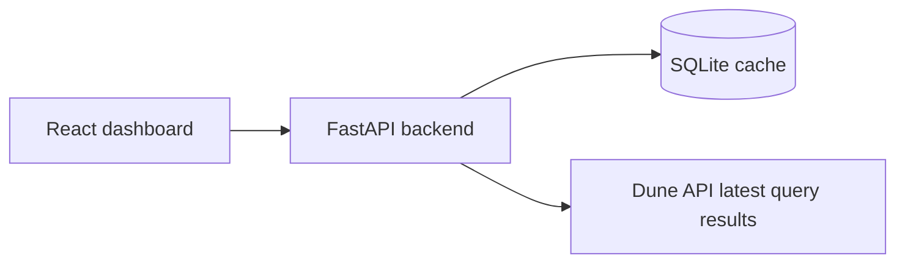

# Market Dashboard

Read-only hiring-test dashboard that compares historical daily market volume on Polymarket and Kalshi. The app now uses Dune saved-query results as the upstream source, materializes those daily rows into local SQLite, and serves the chart from the local backend cache.

## What the app shows

- One shared chart for Polymarket and Kalshi
- Range switches: `7d`, `30d`, `90d`, `all time`
- Category filters materialized from the Dune query results
- Category filter scope: apply filters to both platforms, only Polymarket, or only Kalshi
- Totals cards for both platforms and their difference
- Source and coverage labels
- Loading, empty, stale, and error states
- Manual refresh and CSV export

## Data source

The backend reads the latest completed Dune query results:

- Polymarket: Dune query `7350670`
- Kalshi: Dune query `7345291`

Expected query output:

```text
day, category, daily_volume_usd
```

The parser is intentionally tolerant and also accepts common aliases such as `date`, `trade_day`, `volume_usd`, `volume`, `turnover_usd`, and `amount_usd`.

If a Dune query includes a category column named `category`, `normalized_category`, or `market_category`, the backend stores that category and the existing category filters work directly from SQLite. If no category column is present, the backend falls back to a single `All markets` category.

Polymarket query `7350670` uses `polymarket_polygon.market_trades` as the volume source with `SUM(amount)` for `CLOB trade` rows and maps categories through `polymarket_polygon.market_details.tags`. It currently materializes daily rows from `2024-01-01` onward.

Kalshi query `7345291` uses `kalshi.trade_report` as the volume source with `SUM(contracts_traded)` and maps categories through `kalshi.market_report` by `ticker_name`. This avoids the duplicate-day and missing-day issues seen in category-only `market_report` aggregations.

## How values are calculated

1. `POST /api/admin/sync` fetches the latest Dune result pages for each configured query.
2. The backend normalizes each row to `day_utc`, `platform`, `normalized_category`, and `turnover_usd`.
3. SQLite stores normalized daily category rows in `daily_volume`.
4. `GET /api/volume` reads from SQLite and applies the selected range on the backend:
   - `7d`: latest cached day minus 6 days
   - `30d`: latest cached day minus 29 days
   - `90d`: latest cached day minus 89 days
   - `all`: full cached history

`All time` means all rows currently materialized from the configured Dune query results into local SQLite.

## Architecture



## Stack

- Backend: FastAPI, HTTPX, SQLite, Pydantic
- Frontend: React, Vite, TanStack Query, Recharts

## Environment

Copy `.env.example` to `.env` and set your Dune API key:

```env
DUNE_API_KEY=your_dune_api_key
DUNE_POLYMARKET_QUERY_ID=7350670
DUNE_KALSHI_QUERY_ID=7345291
DUNE_SQL_PERFORMANCE_TIER=free
KALSHI_TRADE_REPORT_FALLBACK_ENABLED=false
KALSHI_TRADE_REPORT_FALLBACK_DAYS=
SYNC_PERIODIC_ENABLED=true
SYNC_PERIODIC_INTERVAL_SECONDS=900
```

## Run locally

### Option 1: Python + Node

Start the backend:

```bash
cd E:\market-dashboard\backend
python -m uvicorn app.main:app --host 0.0.0.0 --port 8000
```

Start the frontend in a second terminal:

```bash
cd E:\market-dashboard\frontend
npm run dev -- --host 0.0.0.0 --port 3000
```

Open `http://localhost:3000`.

### Option 2: Docker Compose

```bash
copy .env.example .env
docker compose up --build
```

## Main API routes

- `GET /api/health`
- `GET /api/categories`
- `GET /api/volume?range=30d&categories=sports,politics&categoryScope=both`
- `POST /api/admin/sync?scope=recent`
- `GET /api/export.csv?range=90d&categories=sports&categoryScope=kalshi`

`categoryScope` can be `both`, `polymarket`, or `kalshi`. For example, `categoryScope=kalshi` filters Kalshi by the selected categories while Polymarket remains unfiltered.

## Tests

```bash
python -m pytest
```

## Known limitations

- The backend trusts the SQL inside the configured Dune saved queries for coverage and correctness.
- Kalshi notional volume is based on traded contracts. A price-weighted cash/premium view can be calculated from `contracts_traded * price / 100`, but it is a different metric and is not used in the main comparison.
- Category quality depends on the category logic inside the configured Dune saved queries.
- Freshness depends on Dune result refresh cadence and the last successful local sync.
- The backend syncs on startup and then periodically according to `SYNC_PERIODIC_INTERVAL_SECONDS`; the frontend also refetches the local API every five minutes.
- The local SQLite cache is demo state, not a canonical warehouse.
