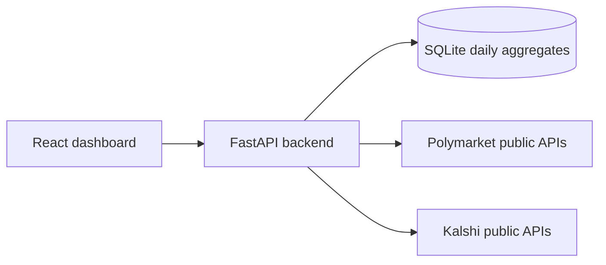

# Market Dashboard

Read-only dashboard that compares historical executed turnover on Polymarket and Kalshi using only public market-data APIs. The frontend talks only to the local backend, and the backend normalizes upstream payloads into UTC daily aggregates stored in SQLite.

## What it does

- Shows Polymarket and Kalshi turnover on one chart.
- Filters by normalized categories across both platforms.
- Switches between `7d`, `30d`, `90d`, and `all time`.
- Handles loading, empty, partial, stale-cache, and error states.
- Uses real upstream data only. No mock JSON snapshots are committed to the repo.
- Supports manual sync and CSV export.

## Stack

- Backend: FastAPI, HTTPX, SQLite, Pydantic
- Frontend: React, Vite, TanStack Query, Recharts
- Runtime model: one backend, one SPA, one local cache database

## Architecture



## Data model and assumptions

- Turnover metric:
  - Polymarket: `size * price`
  - Kalshi recent ranges: daily candlestick `volume_fp * price.mean_dollars`
  - Kalshi raw-trade fallback: `count_fp * traded_side_price`, where traded side is selected from `yes_price_dollars` or `no_price_dollars` by `taker_side`
- All aggregation is bucketed by UTC day.
- Polymarket categories are taken from market metadata and normalized into shared slugs.
- Kalshi categories are resolved from `series.category`, joined through event and market registries.
- `all time` means all history currently materialized in local SQLite from public APIs.

## Running locally

### Option 1: Python + Node

1. Copy `.env.example` to `.env` if you want to override defaults.
2. Start the API:

```bash
cd backend
python -m pip install -r requirements.txt
python -m uvicorn app.main:app --host 0.0.0.0 --port 8000
```

3. Start the web app:

```bash
cd frontend
npm install
npm run dev -- --host 0.0.0.0 --port 3000
```

4. Open `http://localhost:3000`.

### Option 2: Docker Compose

```bash
copy .env.example .env
docker compose up --build
```

## Useful API routes

- `GET /api/health`
- `GET /api/categories`
- `GET /api/volume?range=30d&categories=politics,sports`
- `POST /api/admin/sync?scope=recent`
- `POST /api/admin/sync?scope=all`
- `GET /api/export.csv?range=90d&categories=politics`

## Tests

```bash
python -m pytest
```

Current automated coverage focuses on money calculations, category normalization, and zero-filled daily aggregation behavior.

## Known limitations

- Polymarket trade sync is partial because the public `/trades` endpoint does not expose a complete exchange-wide 90-day daily backfill. For ranges where Gamma metadata provides safe totals (`7d`, `30d`, `all`), cards are supplemented from market metadata and the API returns warnings.
- Polymarket keyset pagination is attempted first, but the adapter falls back to offset pagination if the cursor does not advance.
- Kalshi `recent` sync uses batch daily candlesticks instead of raw trades because trade pagination is too dense to cover full days reliably in a hiring-test runtime.
- Category normalization is intentionally simple and string-based rather than a full ontology.
- The backend stores normalized aggregates and does not persist unnecessary user-profile fields from upstream trade payloads.
