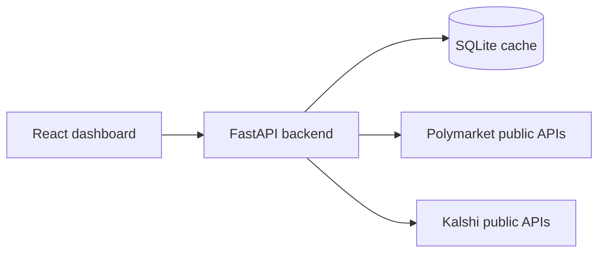

# Market Dashboard

Read-only hiring-test dashboard that compares historical market volume on Polymarket and Kalshi using only public market-data APIs. The frontend talks only to the local backend, and the backend normalizes upstream payloads into UTC daily aggregates stored in SQLite.

## What the app shows

- One shared chart for Polymarket and Kalshi
- Range switches: `7d`, `30d`, `90d`, `all time`
- Category filters across both platforms
- Totals cards for both platforms and their difference
- Visible source labels and coverage badges on cards and chart notes
- Loading, empty, stale, partial, and error states
- Manual refresh and CSV export

## Metric used in this submission

This project now uses one stable metric and does not keep changing it:

- The dashboard shows **market volume in USD notional**.
- It is **not** trying to reconstruct exact premium/cash paid on every fill.
- Internally some fields are still named `turnover_usd`, but for demo purposes they should be read as **USD-notional market volume**.

Current source paths:

- `Polymarket`:
  - Daily chart series comes from public `GET /v1/builders/volume?timePeriod=DAY`, aggregated by UTC day across returned builders.
  - This is a public builder-attributed volume proxy, not a guaranteed full exchange-wide warehouse.
  - Category-filtered Polymarket chart series is estimated by scaling that public daily series by the selected categories' metadata share for the chosen range.
  - Public trades are synced separately as a bounded sample from discovered high-volume events/markets. When they are shown, they are labeled as partial sampled-trade aggregation rather than exchange-wide exact history.
- `Kalshi`:
  - Recent live daily series comes from public candlestick `volume_fp`, aggregated by UTC day across the discovered ticker universe.
  - Archived markets that fall behind Kalshi's historical cutoff are fetched through public `GET /historical/markets/{ticker}/candlesticks`.
  - The recent chart therefore stays candlestick-derived, but it is materially closer to the true recent public market history than a live-only fetch.

## Honesty about data coverage

This submission is designed to be **finished and explainable**, not to be a perfect historical ingestion system.

- `Polymarket` public trade history is partial. The public `/trades` endpoint does not expose a clean full exchange-wide category backfill.
- `Polymarket` trade sync uses market/event-scoped samples discovered from Gamma metadata, with hard page caps. It improves explainability and diagnostics, but it is intentionally not treated as a complete history.
- `Polymarket` chart history uses public builder-volume data. It is real data from a public Polymarket endpoint, but it should be read as builder-attributed volume, not a guaranteed canonical exchange-wide warehouse.
- `Polymarket` category filters are proportional estimates over the platform-wide builder-volume series, using category shares from public market metadata. They are consistent on the chart and cards, but they are not exact raw category trade history.
- `Kalshi` recent data is materialized from public market discovery + candlestick volume, with live and archived tickers routed through the appropriate public endpoints. It is still limited by public API pagination and the local cache.
- Category chips now come from materialized daily rows plus discovered market registry, not from snapshot totals alone. This is stricter and avoids showing filters that only exist because snapshot metadata happened to mention them.
- `All time` means **whatever history is currently materialized in local SQLite**, not guaranteed full platform history.
- When coverage is incomplete, the backend returns `partial=true`, structured `dataQuality`, and warnings, and the UI shows those warnings inline as well as in notifications.
- `GET /api/volume` includes per-platform `dataQuality` with `sourceType`, `sourceLabel`, `coverage`, `coverageReason`, and `isEstimated`.
- No auth layer is included in MVP because both market-data paths used here are public; effort is spent on source truthfulness instead of login or credential plumbing.

## Architecture



## Stack

- Backend: FastAPI, HTTPX, SQLite, Pydantic
- Frontend: React, Vite, TanStack Query, Recharts

## Run locally

### Option 1: Python + Node

This is the safest local demo path if Docker Desktop is not running.

1. Copy `.env.example` to `.env` if you want local overrides.
2. Start the backend:

```bash
cd E:\market-dashboard\backend
python -m uvicorn app.main:app --host 0.0.0.0 --port 8000
```

3. Start the frontend in a second terminal:

```bash
cd E:\market-dashboard\frontend
npm run dev -- --host 0.0.0.0 --port 3000
```

4. Open `http://localhost:3000`.

### Option 2: Docker Compose

```bash
copy .env.example .env
docker compose up --build
```

If Docker Desktop is not running, the compose path will fail and you should use Option 1.

## Main API routes

- `GET /api/health`
- `GET /api/categories`
- `GET /api/volume?range=30d&categories=politics,sports`
- `POST /api/admin/sync?scope=recent`
- `GET /api/export.csv?range=90d&categories=politics`

## Data sync knobs

The defaults are intentionally capped so the demo does not hang on public APIs:

- `POLY_METADATA_RECENT_MAX_PAGES` / `POLY_METADATA_BOOTSTRAP_MAX_PAGES` control Gamma market discovery.
- `POLY_TRADE_CANDIDATE_EVENTS` and `POLY_TRADE_CANDIDATE_MARKETS` cap the raw Polymarket diagnostic sample.
- `POLY_TRADE_PAGES_PER_CANDIDATE` caps pages per discovered event/market.
- `KALSHI_DIRECT_MARKET_RECENT_MAX_PAGES` and `KALSHI_CANDLESTICK_CHUNK_SIZE` control Kalshi registry/candlestick materialization.
- `KALSHI_HISTORICAL_MARKET_RECENT_MAX_PAGES` controls how much archived recent Kalshi market coverage is discovered before historical candlestick fetches.

## Tests

```bash
python -m pytest
```

Current automated coverage is intentionally small and focuses on:

- money/volume helper functions
- category normalization
- zero-filled daily aggregation behavior

## Known limitations

- Polymarket category-filtered daily history is partial from public trades alone.
- Polymarket daily chart history is sourced from public builder-volume data, which is a proxy rather than guaranteed full exchange volume.
- Polymarket category-filtered daily chart history is a proportional estimate from builder-volume daily data and metadata category shares.
- Kalshi recent volume is candlestick-derived, not a full raw-trade reconstruction, even though archived recent markets now route through the historical candlestick endpoint when needed.
- Category normalization is intentionally string-based, not a full cross-platform ontology.
- The local cache is built from public data at runtime and should be treated as materialized demo state, not as a canonical warehouse.
